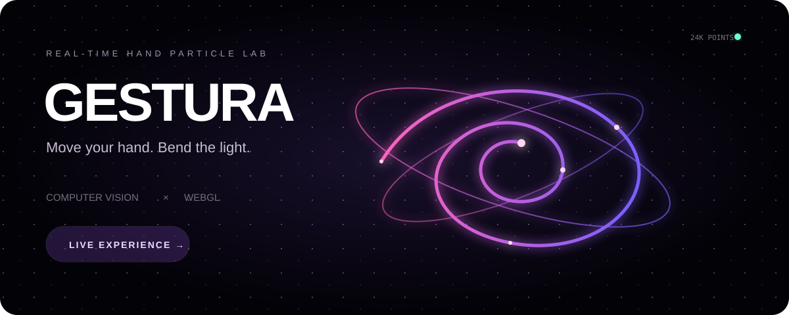
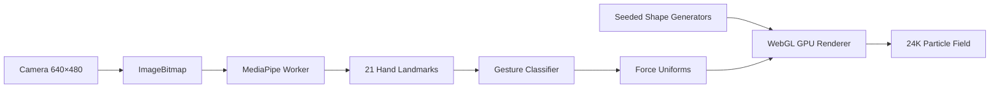

<p align="center">
  
</p>

<p align="center">
  <a href="https://syedsaud15.github.io/gestura/"><strong>Launch Live Experience</strong></a>
  ·
  <a href="#gestures">Gestures</a>
  ·
  <a href="#architecture">Architecture</a>
</p>

<p align="center">
  
  
  
</p>

## Move your hand. Bend the light.

GESTURA is an interactive browser experiment that turns hand gestures into forces inside a 24,000-particle WebGL field. Pick a shape, enable the camera and manipulate light without touching the screen.

The full vision pipeline runs inside the browser. Camera frames stay on the device, MediaPipe inference runs in a Web Worker, and only normalized gesture data reaches the renderer.

### What makes it special

- **Seven morphing fields** — Galaxy, Wormhole, DNA, Knot, Wave, Heart and your own name.
- **Natural interaction** — move, attract, compress, expand and explode particles with hand gestures.
- **GPU animation** — geometry morphing and force response happen in a WebGL vertex shader.
- **Smooth under pressure** — one inference frame stays in flight while rendering continues independently.
- **Built for sharing** — fullscreen mode, automatic showcase, PNG capture and WebM recording.
- **Graceful fallback** — a Canvas renderer keeps the experience available when WebGL is restricted.

## Gestures

| Gesture | Particle response |
| :---: | --- |
| ✋ **Move palm** | Orbit and steer the field |
| 🤏 **Pinch** | Pull particles toward your hand |
| ✊ **Fist** | Compress the entire formation |
| ✊ → ✋ **Open** | Trigger an energy burst |
| 👐 **Two hands** | Expand or contract the field |

Mouse and touch controls work without a camera: drag to orbit, scroll to zoom, and use **Burst** for an explosion.

## Architecture



The renderer uploads geometry only when a shape changes. Every animation frame updates compact uniforms for time, rotation, scale, pointer force and colour. Interrupted transitions continue from their current interpolated positions, so rapid scene changes remain smooth.

## Technology

| Layer | Technology |
| --- | --- |
| Interface | React 19, TypeScript, Vinext/Vite |
| Rendering | WebGL shaders with Canvas 2D fallback |
| Computer vision | MediaPipe Hand Landmarker, local WASM/model |
| Concurrency | Dedicated Web Worker, single-frame backpressure |
| Export | Canvas PNG capture and MediaRecorder WebM |
| Hosting | GitHub Pages through GitHub Actions |

## Run locally

Requires Node.js 22.13 or newer.

```bash
git clone https://github.com/syedsaud15/gestura.git
cd gestura
npm install
npm run dev
```

Open the local URL, press **Enable hand control**, allow camera access and hold your palm inside the preview.

```bash
npm test       # geometry and gesture checks
npm run build  # static production build
```

## Privacy and performance

- No camera frame is uploaded or stored.
- Hand tracking stops and camera tracks close when the control is disabled.
- Desktop targets 24,000 particles; smaller screens use 12,000.
- Inference is throttled and isolated from the animation thread.
- FPS shown in the interface is measured live on the current device.

## Project layout

```text
app/                    experience UI and styling
components/             hand-control and interface components
lib/particles.ts        geometry generators + WebGL/Canvas engines
lib/gestures.ts         gesture interpretation
public/hand-worker.js   off-thread vision pipeline
public/vision/          local MediaPipe runtime and model
tests/                  deterministic geometry and gesture tests
```

---

<p align="center"><strong>Designed and engineered by Syed Saud Alam</strong><br/>If this experiment inspired you, consider starring the repository.</p>
