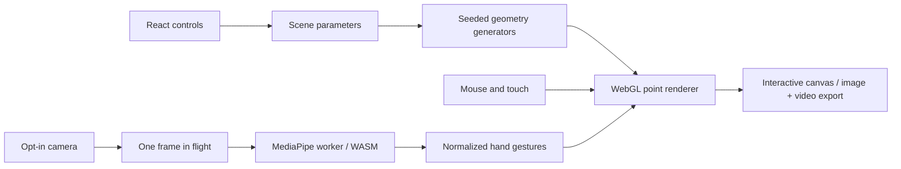

# Reality Composer

A browser-based particle studio: sculpt a galaxy, explore a wave field, or turn your initials into light. Built around a real WebGL canvas, with optional webcam gestures processed locally in a dedicated worker.

## Immersive release

- Eight deterministic scenes: Andromeda galaxy, black-hole singularity, Saturn, double helix, torus knot, wave field, heart field and custom signature.
- GPU-interpolated transitions, additive particle glow and a supernova burst.
- Drag to orbit, scroll to zoom, colour palettes, expansion and luminosity controls.
- Hand tracking: palm movement, pinch attraction, fist collapse, open-palm burst and two-hand expansion.
- Cinematic onboarding, fullscreen presentation, timed showcase, PNG export and one-click WebM showcase recording.
- 24,000 WebGL particles on capable desktop browsers, with a Canvas fallback for restricted browser environments. FPS is measured live; it is not a promised frame rate.

## Run

Requires Node.js 22.13+ and npm. Node.js 24 is recommended for native TypeScript configuration loading.

```sh
npm install
npm run dev
npm test
npm run build
```

The static production site is in `dist/client`. Serve it over HTTPS (or localhost for development) for camera access. The complete hand model and WASM files are served from `public/vision`; no inference API or API key is required.

## Controls

| Input | Action |
| --- | --- |
| Drag / touch-drag | Orbit |
| Scroll | Zoom |
| Space | Pause / resume |
| Left / right arrow | Select scene |
| E | Impact burst |
| H | Hide / show controls |
| Escape | Leave presentation |
| Pinch | Attract particles |
| Fist → open palm | Collapse → burst |
| Two hands apart | Expand |

## Architecture



The geometry buffers upload on scene changes; animation updates uniforms instead of uploading every point each frame. Morphs begin from the currently interpolated positions, including when interrupted. Hand inference is throttled and runs outside the rendering thread, with only one frame in flight. Camera tracks and workers are released when hand control stops or the component unmounts.

## Scope and verification

These are artistic mathematical scenes and visual force fields, not astrophysics, molecular dynamics or physically accurate N-body simulations. Webcam tracking depends on lighting, visibility and the device. The intro, galaxy, black hole, scene switching, field controls and responsive mobile layout were checked in the in-app browser with no console errors. A real-camera gesture session is still pending. Automated checks cover all mathematical geometry and gesture interpretation; production compilation and static-page generation are also checked.

The optional `compose_particle_scene` WebMCP tool is feature-detected. Its registration and execution require a compatible host; that host integration has not been verified here.

## Credits

Interface: React, Vinext/Vite, Tailwind CSS, Base UI/Shadcn, Lucide. Hand landmarks: [Google MediaPipe](https://ai.google.dev/edge/mediapipe/solutions/vision/hand_landmarker/web_js), `@mediapipe/tasks-vision` 0.10.21 and the official float16 hand-landmarker model. See `THIRD_PARTY_NOTICES.md`.

## Next milestones

Real-device gesture calibration, measured performance profiles, touch pinch-to-zoom, music-reactive mode, and a short recorded demo. Public GitHub publication is a separate step.
